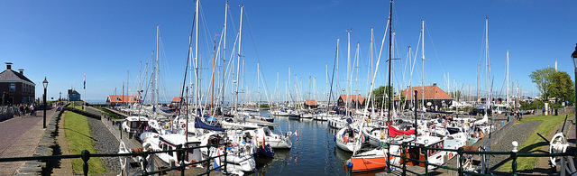
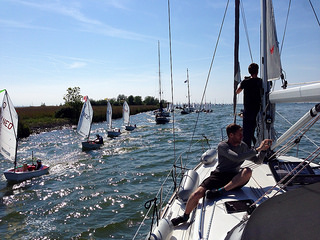
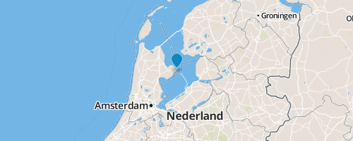
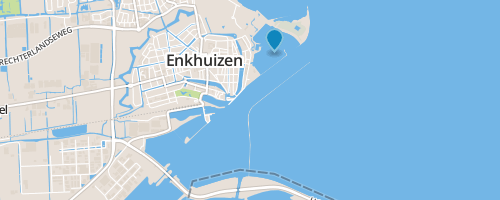
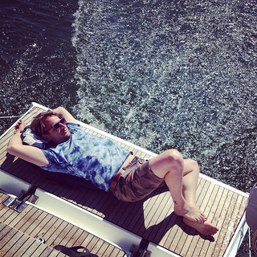

## What
- An unforgettable sailing experience
- Visiting local cozy villages and towns
- Staying for a night in marinas with showers & restaurants
- Enjoying a sun by day and evening sunset
- Stay on a modern 12 meter sailing boat in own cabin
- Bring your friends or meet new (up to 10 ppl on the boat)

## Where
- Netherlands, Noorth-holland, Enkhuizen
- Markermeer & IJsselmeer lakes
- 1 hour ride on train from Amsterdam

## Contact
- [t@kalapun.com](mailto:t@kalapun.com)
- [Facebook page](http://fb.com/groups/yachtingweekend/)
- Or **[Apply here](http://bit.ly/tksw)** if you are ready :)

